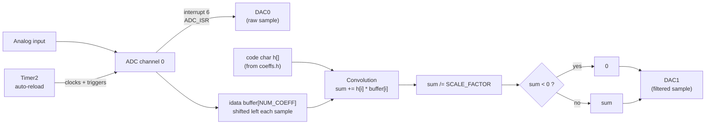
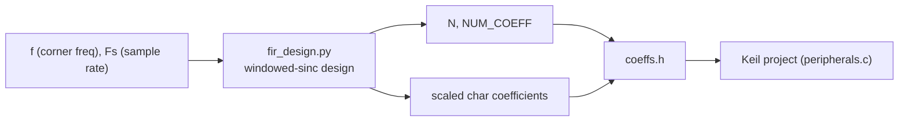

# FIR Low-Pass Filter

Samples an analog input on ADC channel 0, and outputs both the raw signal
and an FIR-filtered (low-pass) version of it, in real time.

## Block diagram



## Offline design (Python)



The coefficients are **not** computed on the microcontroller — `fir_design.py`
designs an ideal low-pass filter (windowed sinc) offline, rescales the
coefficients to fit in a signed `char` (-128..127), and writes them into
`coeffs.h` as a `code`-segment array (so they live in Flash, not RAM).

```
python fir_design.py <corner_freq_Hz> <sample_rate_Hz>
```

`coeffs.h` currently holds **placeholder values** (f=100Hz, Fs=1kHz) —
regenerate it with the lab's actual target parameters, and update
`SetTimer2_ADC_DAC.c`'s Timer2 reload value to match (the script prints
the correct value to use).

## Why a `long int` for the convolution sum

Each term is a 12-bit ADC sample times an 8-bit coefficient, summed over
up to `NUM_COEFF` taps — this can overflow a 16-bit `int`, so the sum is
accumulated in a `long int`, and both operands are cast to `long int`
**before** multiplying (otherwise the multiplication itself happens in
16-bit arithmetic and can already overflow before the result is widened).

## Files

| File | Role |
|---|---|
| `main.c` | Init only — all the filtering happens in the ADC interrupt |
| `peripherals.c` / `.h` | `ADC_ISR`: shifts the sample buffer, convolves with the coefficients, rescales, clamps, and writes both DACs |
| `SetTimer2_ADC_DAC.c` / `.h` | Timer2 (ADC sample clock), ADC, and DAC register setup |
| `coeffs.h` | Generated coefficient data (`N`, `NUM_COEFF`, `SCALE_FACTOR`, `h[]`) — do not hand-edit |
| `fir_design.py` | Designs the filter and generates `coeffs.h` |

## Key registers

- `T2CON`, `RCAP2H/L`, `TH2`/`TL2` — Timer2 setup (16-bit auto-reload, clocks the ADC via `T2C`)
- `ADCCON1` (`T2C`, `CCONV`), `ADCCON2` (channel select) — ADC configuration
- `DACCON` — 12-bit mode, VREF range, both DACs powered on
- ADC interrupt: `interrupt 6`
