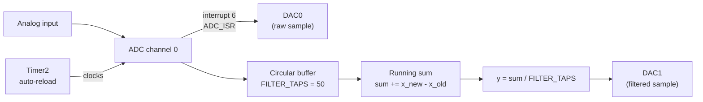

# Moving Average Filter

Samples an analog input on ADC channel 0, and outputs both the raw signal
and a smoothed (moving-average filtered) version of it, in real time.

## Block diagram



## How the filter works

Instead of re-summing all 50 samples on every new sample (`O(N)` per
sample), the running sum is updated incrementally:

```
sum[n] = sum[n-1] + x_new - x_old
y[n]   = sum[n] / FILTER_TAPS
```

`x_old` is the sample being evicted from the circular buffer (the one
`FILTER_TAPS` samples ago) and `x_new` is the incoming sample — so each
new sample only costs one addition and one subtraction, not a full
re-sum.

## Files

| File | Role |
|---|---|
| `main.c` | Ties everything together: init, then on each new sample (`FLAG`), updates the buffer/sum and writes both DACs, synchronized via the DACCON sync bit |
| `peripherals.c` / `.h` | `ADC_ISR` (reads the sample, sets `FLAG`) and the circular buffer implementation |
| `SetTimer2_ADC_DAC.c` / `.h` | Timer2 (ADC sample clock), ADC, and DAC register setup |
| `setTimer2.py` | Generates `SetTimer2_ADC_DAC.c/.h` for a target ADC sample rate — **note:** its reload-value formula currently has a bug (see the inline comment); the checked-in `.c`/`.h` files were taken from the verified working project instead |

## Key registers

- `T2CON`, `RCAP2H/L`, `TH2`/`TL2` — Timer2 setup (16-bit auto-reload, clocks the ADC via `T2C`)
- `ADCCON1` (`T2C`, `CCONV`), `ADCCON2` (channel select) — ADC configuration
- `DACCON` bit 2 — synchronizes DAC0/DAC1 updates so both outputs change together
- ADC interrupt: `interrupt 6`
